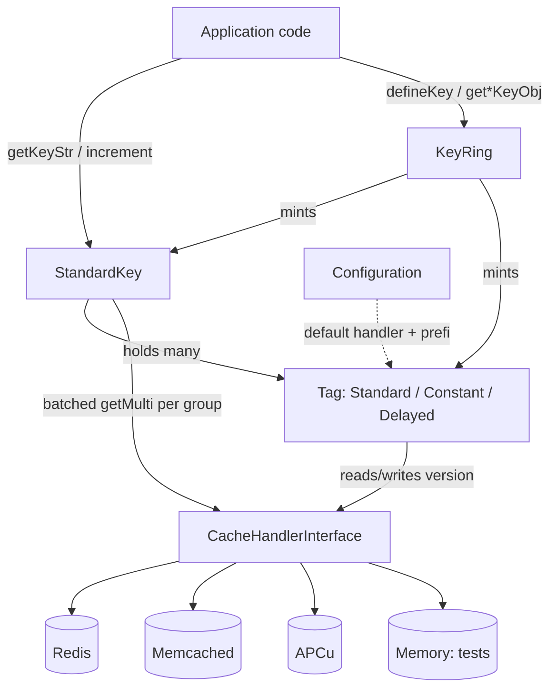

# Project Architecture

## Overview

**Fragmented Keys** is a PHP 8.4 library implementing *version-based cache
invalidation*. A composite cache key is assembled from a set of independently
versioned **tags**; the final key string embeds each tag's current version.
Incrementing a tag's version changes every derived key that references it, so an
arbitrarily large set of dependent cache entries becomes unreachable in a single
O(1) write — no scans, no bulk deletes. Orphaned entries fall off naturally via
the backing store's TTL/LRU.

The library is a small set of interfaces plus swappable implementations. There
is no runtime, server, or persistence of its own: it stores only tag→version
counters in a pluggable cache backend (Redis, Memcached, APCu, or in-memory) and
computes key strings from them.

## System Diagram

## Core Components

| Component | Purpose |
|-----------|---------|
| `KeyInterface` / `StandardKey` | Composite key — holds tags, resolves versions, emits final (md5) key string |
| `TagInterface` / `StandardTag` | Named, versioned dimension (`tag_instance`); persists version to a handler |
| `ConstantTag` | Immutable tag — fixed version, no cache lookup, mutations are no-ops |
| `DelayedTag` | Grace-window tag — serves previous version for `delaySeconds` after an increment |
| `KeyRingInterface` / `KeyRing` | Factory/registry — define key templates once, mint keys/tags with merged options |
| `CacheHandlerInterface` | Backend adapter contract: `groupName`, `get`, `set`, `getMulti` |
| `Configuration` | Process-global defaults: default cache handler and global key prefix |

## Data Flow — Read Path (build a key)

The application asks a `KeyRing` (or constructs a `StandardKey` directly) for a
key. `getKeyStr()` groups the key's tags by their handler's `groupName()`,
issues **one `getMulti()` per backend** to fetch all versions at once, applies
each version to its tag (resetting any missing tag to a fresh version), then
concatenates `label_group:t{tagName}:v{version}…` and returns its md5 hash. The
returned string is what the application uses against its own cache.

## Data Flow — Invalidation Path (bump a tag)

To invalidate, the caller builds the same tag (`new StandardTag('User', $id)` or
via the ring) and calls `increment()`. The tag reads its current version, adds
one, and persists it back to the handler. Every subsequent `getKeyStr()` that
includes that tag now produces a different hash, orphaning the prior entries. No
dependent keys are enumerated or deleted.

## Option Resolution (KeyRing)

When minting a tag, `KeyRing` merges option maps in increasing precedence:
`globalOptions` → `globalTagOptions[tag]` → key-level `globals` → per-param
options. The resolved `type` selects the tag class (`standard` / `constant` /
`delayed`); `cache_handler` selects a named handler; `version`, `prefix`, and
`delay_seconds` tune the instance. A magic `get{Name}KeyObj(...)` accessor maps
method calls to defined key templates.

## Technology Stack

| Concern | Choice |
|---------|--------|
| Language | PHP `^8.4` (strict types, readonly promoted props, `match`, typed class constants) |
| Required ext | `ext-json`; `ext-redis` / `ext-memcached` / `ext-apcu` suggested per handler |
| Autoload | PSR-4 — `NoizuLabs\FragmentedKeys\` → `src/FragmentedKeys/` |
| Tests | PHPUnit 11 (Unit + Integration suites; Redis/Memcached/APCu integration) |
| Static analysis | PHPStan level 8 |
| Style | php-cs-fixer (`@PER-CS2.0`, strict types) |
| CI | GitHub Actions with redis + memcached service containers, coverage gate |

## Key Decisions

- **Invalidate by version bump, not deletion** — one write invalidates any number
  of dependent keys; the backing store reclaims orphaned entries via TTL/LRU.
- **Batched version resolution** — tags are grouped by backend (`groupName()`) and
  fetched with a single `getMulti()` each; `ConstantTag` opts out via
  `delegateCacheQuery()`, avoiding needless lookups.
- **Mixed backends per key** — tags in one key may live on different handlers;
  grouping resolves each backend independently, so a key can span, e.g., APCu +
  Redis.
- **Microsecond-timestamp reset versions** — a fresh/reset version is
  `round(microtime(true) * 1_000_000)` as an int64, giving monotonic,
  collision-resistant versions that round-trip through string storage without
  float precision loss.
- **Global-static configuration** — `Configuration` supplies a default handler and
  prefix so tags can be constructed without threading dependencies everywhere;
  any tag may override both per instance.
